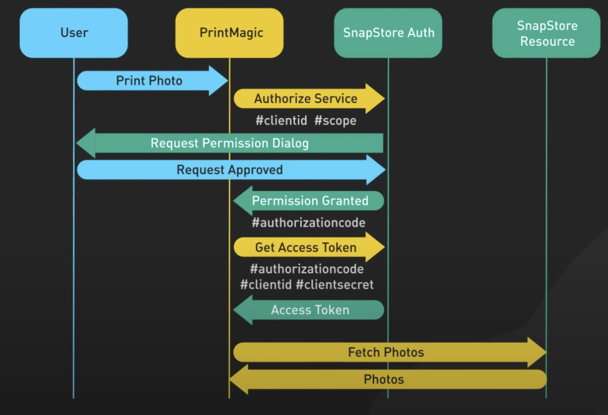

# Google OAuth 2.0 Authentication with Passport.js and Express Session

This document explains how to implement **Google OAuth 2.0 authentication** using **Passport.js** with **Express Session** for maintaining user authentication in a Node.js application. It covers the steps and provides important code snippets.

---

## Request Flow



---

## Table of Contents
1. [Overview](#overview)
2. [Step-by-Step Authentication Flow](#step-by-step-authentication-flow)
3. [Setting Up Google OAuth 2.0](#setting-up-google-oauth-20)
4. [Passport Setup](#passport-setup)
5. [Session Management](#session-management)
6. [Example Code](#configuration-example)
7. [Request Flow Summary](#request-flow-summary)
8. [Conclusion](#conclusion)

---

## Overview

In this flow, a user can log in to your application using their **Google account**. Once logged in, the user's **profile** and **email** are retrieved, and they are redirected to a protected route. We will use **Passport.js** for authentication and **Express Session** to manage user sessions.

## Step-by-Step Authentication Flow

1. **User Clicks "Login with Google"**: When the user visits the homepage (`/`), they are presented with a link to login using Google. Clicking this link redirects the user to Google's OAuth consent screen.

2. **Redirect to Google**: The user is sent to Google’s OAuth consent screen to authenticate (if not already logged in) and grant permissions for the requested scopes (e.g., profile and email).

3. **Google Sends Authorization Code**: Once the user consents, Google redirects them back to your application with an authorization code in the query parameter.

4. **Exchange Code for Tokens**: The authorization code is sent to Google's token endpoint to exchange it for an access token and refresh token. These tokens allow your app to access the user’s data.

5. **Retrieve User Profile**: The access token is used to make an API call to Google’s userinfo endpoint to get the user’s profile and email.

6. **Serialize User and Store in Session**: The user's profile is serialized and stored in the session using `passport.serializeUser()`.

7. **Redirect to Protected Route**: After successful authentication, the user is redirected to a protected route, where they can access their authenticated data.

---

## Setting Up Google OAuth 2.0

1. **Create a Google Project**:
   - Go to the [Google Cloud Console](https://console.cloud.google.com).
   - Create a new project or select an existing one.
   
2. **Enable OAuth 2.0**:
   - Navigate to **APIs & Services** > **OAuth consent screen**.
   - Choose **External** as the user type and provide basic information like app name and contact email.
   - Under **Scopes**, add the following scopes:
     - `https://www.googleapis.com/auth/userinfo.profile`
     - `https://www.googleapis.com/auth/userinfo.email`

3. **Create OAuth Credentials**:
   - Go to **Credentials** > **Create Credentials** > **OAuth 2.0 Client IDs**.
   - Set the **Authorized redirect URI** to `http://localhost:3000/auth/google/callback` (or whatever your callback URL is).

4. **Store the Client ID and Secret**:
   - Copy the **Client ID** and **Client Secret** and store them in your `.env` file:
     ```env
     GOOGLE_CLIENT_ID=your-client-id
     GOOGLE_CLIENT_SECRET=your-client-secret
     CALLBACK_URL=http://localhost:3000/auth/google/callback
     ```

---

## Passport Setup

We will use Passport.js to handle the OAuth 2.0 flow with Google. Passport will manage the redirection, exchanging the authorization code for tokens, and retrieving the user's profile.

**Install required packages**:

```bash
npm install passport passport-google-oauth2 express-session dotenv
```

## Session Management

The express-session middleware is used to manage the user session after they log in successfully. This ensures that the user’s session remains active across different pages.

## Configuration Example:
```js
app.use(
  session({
    secret: "mysecretkey", // using env
    resave: false,
    saveUninitialized: false,
    cookie: {
      secure: false, // Set to true for HTTPS
      maxAge: 24 * 60 * 60 * 1000, // 24 hours
    },
  })
);
```

## Passport Initialize:

```js
app.use(passport.initialize());
app.use(passport.session());
```

## Passport Strategy Setup:

```js
passport.use(
  new GoogleStrategy(
    {
      clientID: GOOGLE_CLIENT_ID,
      clientSecret: GOOGLE_CLIENT_SECRET,
      callbackURL: CALLBACK_URL,
      passReqToCallback: true,
    },
    function (request, accessToken, refreshToken, profile, done) {
      User.findOrCreate({ googleId: profile.id }, function (err, user) {
        return done(null, profile);
      });
    }
  )
);
```

## Serialize and Deserialize User:

1. `serializeUser`: This function is used to store minimal user information (like the user’s ID or entire profile) in the session.

```js
passport.serializeUser(function (user, done) {
  done(null, user);
});
```

2. `deserializeUser`: This function is used to retrieve the full user information from the session.

```js
passport.deserializeUser(function (user, done) {
  done(null, user);
});
```

## Request Flow Summary

1. User Clicks "**Login with Google**" → Redirects to `/auth/google` route, which sends the user to Google OAuth.

2. **Google OAuth** → User authenticates and grants permissions, then Google redirects back to `/auth/google/callback` with an authorization code.

3. **Exchange Code for Tokens** → Passport exchanges the code for access tokens.

4. **Retrieve User Profile** → Passport retrieves the user’s profile using the access token.

5. **Store User in Session** → The user’s profile is stored in the session using `serializeUser`.

6. **Redirect to Protected Route** → The user is redirected to `/protected` where their information is shown.

## Conclusion

This guide explains how to implement Google OAuth 2.0 authentication with Passport.js and Express Session. It covers how to authenticate users via Google, retrieve their profile data, and manage user sessions within a Node.js app.